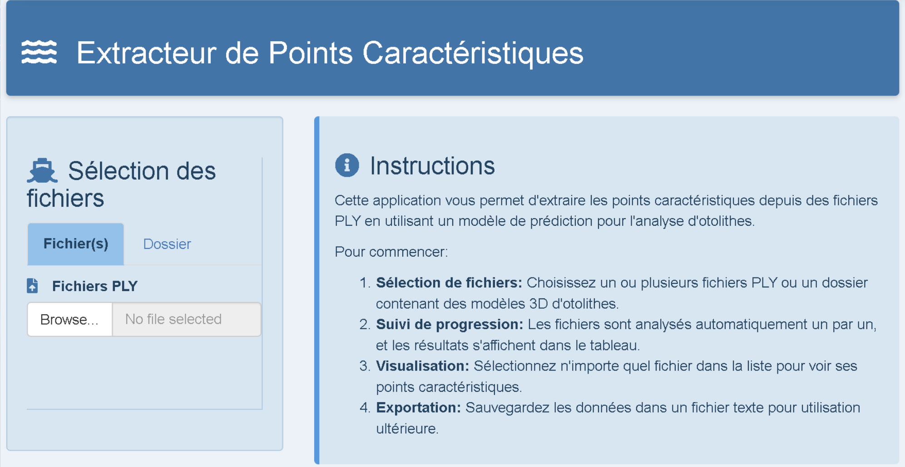
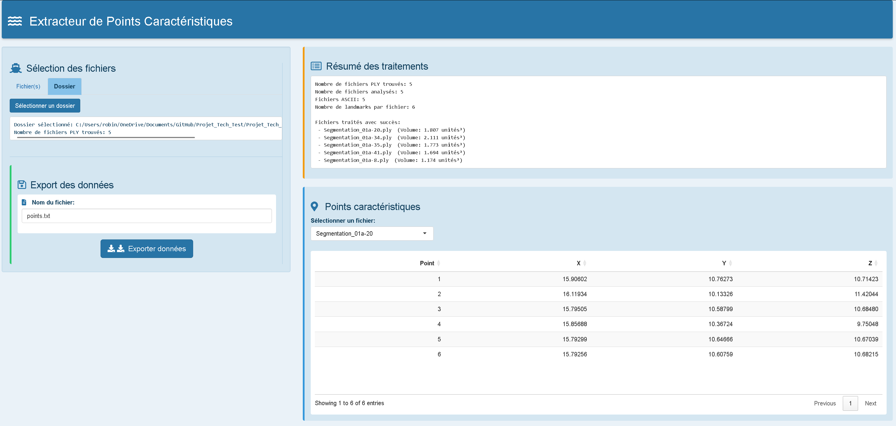
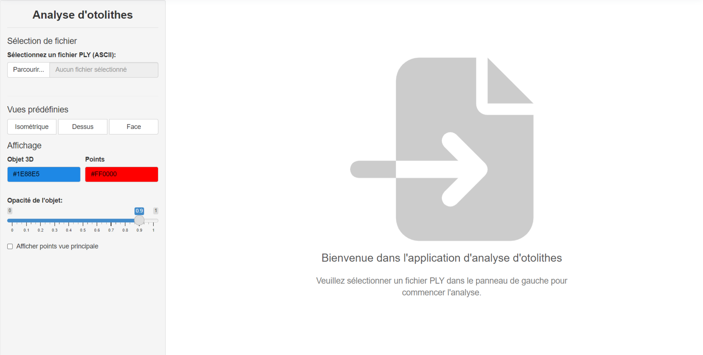
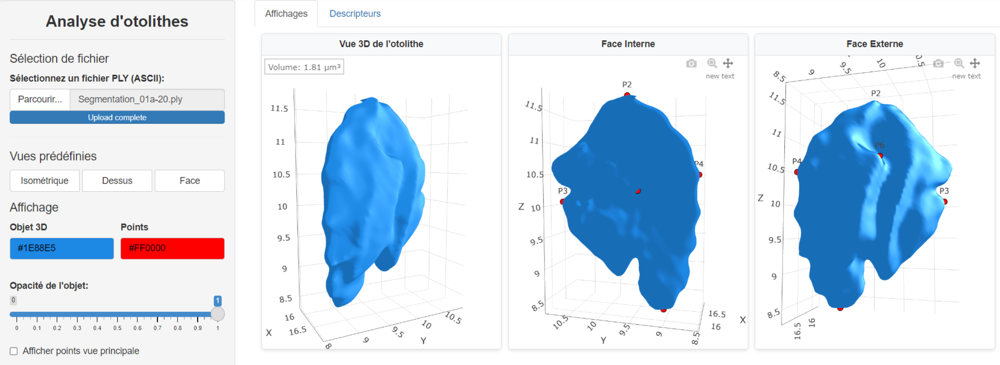

# 3D objects analysis - Otoliths

[](https://www.r-project.org/)
[](https://torch.mlverse.org/)

This project focuses on the automation and analysis of 3D objects. Otoliths, small calcified structures found in the inner ear of fish, are commonly used in fisheries science to estimate age, growth, and population structure. By leveraging machine learning and 3D geometry analysis, this tool aims to identify key morphological landmarks on otolith meshes (.ply files), enabling faster and more consistent analysis for ecological and biological research.

## Project Applications Overview

Two distinct Shiny applications were developed to cover the complete workflow from automated landmark extraction to interactive 3D visualization and detailed analysis.

---

### 1\. Landmark Extraction Application (Extract_App)

This application is designed for efficient batch processing of 3D otolith models, automating the crucial step of landmark identification using a trained machine learning model.

<table>
  <tr>
    <td width="50%" align="center">
      
      <em>Interface for PLY file selection and batch processing.</em>
    </td>
    <td width="50%" align="center">
      
      <em>Detailed results table showing extracted landmarks and volume.</em>
    </td>
  </tr>
</table>

#### Main Features
- **Automatic Landmark Prediction:** Utilizes a PyTorch-based model (via the `torch` package for R) to precisely identify key morphological points on the otolith surface.
- **Surface Projection:** Geometrically projects predicted landmarks onto the 3D mesh surface using advanced geometric calculations.
- **Batch Processing:** Efficiently handles multiple `.ply` files simultaneously, with automatic conversion for both ASCII and binary formats.
- **Physical Descriptors:** Calculates object volume and other standardized geometric data, providing quantitative insights.
- **Data Export:** Exports all extracted landmarks and descriptors into a standardized, easy-to-parse text format.

---

### 2\. Visualization & Analysis Application (View_App)

This interactive viewer provides comprehensive tools for examining 3D otolith models, visualizing extracted landmarks, and performing in-depth morphological analysis.

<table>
  <tr>
    <td width="50%" align="center">
      
      <em>Interface for PLY file selection.</em>
    </td>
    <td width="50%" align="center">
      
      <em>Interactive 3D visualization of an otolith model.</em>
    </td>
  </tr>
</table>

#### Main Features
- **Interactive 3D Engine:** Real-time manipulation (rotation, zoom, pan) of 3D otolith meshes for thorough inspection.
- **Surface & Landmark Visualization:** High-resolution display of internal/external surfaces, with configurable visibility for extracted characteristic points.
- **Visual Customization:** Real-time adjustment of model colors, opacity, background, and point rendering settings.
- **Morphological Descriptors:** Integrated tabs for displaying detailed information such as volume, dimensions, and other computed metrics.
- **Flexible Data Loading:** Supports direct loading of `.ply` files for visualization and analysis.

---

## Technical Stack

* **Logic & Environment:** R (version 4.0 or higher)
* **Deep Learning Backend:** `torch` (PyTorch for R)
* **UI Framework:** `shiny`, `bslib`, `shinyjs`, `shinyFiles`
* **3D Rendering & Geometry:** `plotly`, `rgl`, `Rvcg`, `geomorph`
* **Data Handling:** `data.table`, `stringr`
* **Interactivity & Utilities:** `colourpicker`, `DT`, `cluster`

---

## Prerequisites

This project requires R (version 4.0 or higher) and the packages listed in the Technical Stack.

---

## Installation

1.  **Clone the Repository:**
    ```bash
    git clone [https://github.com/RobinBecard/Otolith-landmark-prediction-analysis.git](https://github.com/RobinBecard/Otolith-landmark-prediction-analysis.git)
    ```

2.  **Install R Dependencies:**
    Open R and run the following commands to install all necessary packages:
    ```r
    # For the Extractor Application
    source("Setup_Extractor.R")

    # For the Viewer Application
    source("Setup_ViewApp.R")
    ```

---

## Usage

### Launching the Applications

1.  **To start the Landmark Extraction Application:**
    ```r
    source("Extractor_App.R")
    ```

2.  **To start the 3D Viewer Application:**
    ```r
    source("View_App.R")
    ```

### Workflow

#### Landmark Extraction (Extractor_App)
1.  Navigate to the "File Selection" tab.
2.  Select one or more `.ply` files, or an entire folder containing your 3D otolith models.
3.  The application will automatically process the selected files, extract characteristic points using the embedded prediction model, and compute the volume.
4.  Review the extracted landmarks and descriptors in the displayed table.
5.  Use the export functionality to save the results in a standardized text format.

#### 3D Visualization (View_App)
1.  Load a `.ply` file using the designated input control.
2.  Interact with the 3D model: rotate, zoom, and pan to inspect the otolith from various angles.
3.  Utilize the "Visualization Parameters" to adjust colors, opacity of surfaces, and the display of landmark points.
4.  Switch to the "Descriptors" tab for a detailed breakdown of calculated morphological information.

---

## Data Format

### PLY Input Format
The application supports the Polygon File Format (.ply), specifically designed for storing 3D data. Both ASCII and binary encoded `.ply` files are handled, with automatic internal conversion when necessary.

### Landmark Output Format
The exported landmark data is presented in a structured text file, making it directly compatible with geometric morphometrics software. The format includes metadata (e.g., number of landmarks, volume) followed by the XYZ coordinates of each landmark.

---

## Author

Robin BECARD, Adrien SKRZYPCZAK, Rémi DAMBRICOURT
